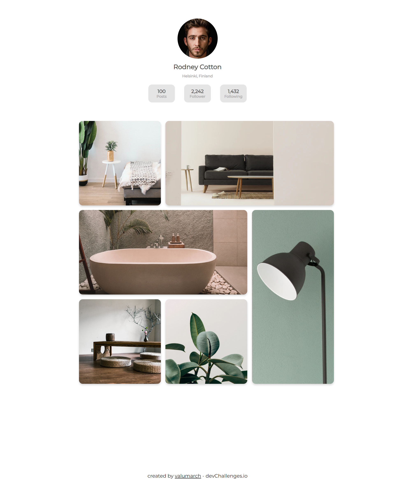

<h1 align="center">Gallery - devChallenges</h1>

   Solution for a challenge from  <a href="http://devchallenges.io" target="_blank">Devchallenges.io</a>.

  <h3>
    <a href="https://valumarch.github.io/gallery-challenge/">
      Demo
    </a>
     | 
    <a href="https://github.com/valumarch/gallery-challenge">
      Solution
    </a>
     | 
    <a href="https://devchallenges.io/challenges/gcbWLxG6wdennelX7b8I">
      Challenge
    </a>
  </h3>

<!-- TABLE OF CONTENTS -->

## Table of Contents

- [Overview](#overview)
  - [Built With](#built-with)
- [Features](#features)
- [Contact](#contact)
- [Acknowledgements](#acknowledgements)

<!-- OVERVIEW -->

## Overview

### Built With

- HTML
- CSS

## Features

This application/site was created as a submission to a [DevChallenges](https://devchallenges.io/challenges) challenge. The [challenge](https://devchallenges.io/challenges/gcbWLxG6wdennelX7b8I) was to build an application to complete the given user stories.

## Acknowledgements

- [Steps to replicate a design with only HTML and CSS](https://devchallenges-blogs.web.app/how-to-replicate-design/)

## Contact

- GitHub [@valumarch](https://{github.com/valumarch})

